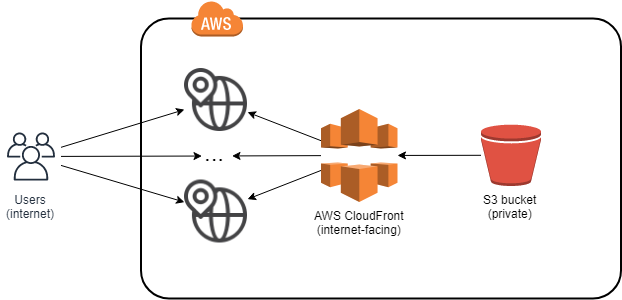

# Reasoning about the chosen technology

Assumption:

* It's a public, internet-facing website.
* It's not an internal website.

NOTE: I have not verified this assumption.

Thought process:

* Deploy EC2 instance(s) running a web server? No, an overkill for a basic website and harder to scale.
* Deploy a dockerised web app on AWS ECS? No, still too complex for a simple PoC with a basic website with some text and an image.
* Deploy a serverless website on AWS Lambda? No, still too complex for a basically static website.
* Deploy a static website on S3? Yes... but almost too simple, so I've added a CloudFront (CDN) to it.

## From the requirements

> demonstrate a basic website with some text and an image, hosted and managed using modern standards and practices in AWS

* Applying "Infrastructure as a Code" principle - using terraform.
* Applying LEAN principles, delivering value quickly - using AWS S3 and AWS CloudFront.

> You can create your own application, or use open source or community software.

* I've created my own Single Page Application (SPA) which consists of a single page with a sample text and an image.

> The proof of concept is to demonstrate hosting, managing, and scaling an enterprise-ready system.
> This is not about website content or UI.

* Hosting is done in AWS S3
* Managing is done using terraform
* Scaling is provided automatically by AWS S3 and AWS CloudFront Distribution by default, but can be further optimized by modifying the AWS S3 or the AWS CloudFront Distribution properties in the terraform configuration.
* In this example, the sample website is a static website (since this is not about website content or UI). It could be easily changed to a dynamic serverless website - using the HTML/CSS/JS code still deployed to S3 and the "dynamic" backend code deployed to a AWS Lambda function(s) exposed via API Gateway endpoint(s). See e.g. <https://ordina-jworks.github.io/cloud/2019/01/14/Infrastructure-as-code-with-terraform-and-aws-serverless.html>.

I've used <https://github.com/cloudposse/terraform-aws-cloudfront-s3-cdn> terraform module to do the heavy lifting, but if necessary this module could be forked and updated to meet additional requirements.

## AWS S3 buckets

* I've chosen AWS S3 buckets as a storage space for the website content.
* S3 storage is well scalable and can be configured to be secure.
* All content stored in S3 is private by default and not accessible from internet.
* There is a free tier avaiable with some limits, but good enough to start with for a small website.
* S3 buckets can host a static website (which is the case in this example), Single Page Application (SPA) content and also dynamic website's binaries.

## AWS CloudFront

* AWS CloudFront (Content Delivery Network aka CDN) to make it available from internet.
* In this example, I've embedded the website content in the same repository for simplicity of the Proof of Concept and keeping everything in one repository. However the code would be later typically split so that one repository has the website/application code and a different repository has the infrastructure code - to apply Single Responsibility Principle. Depending on further requirements and roles in the team,
  multi-skilled developers may still own the complete end-to-end solution, including website content and the terraform deployment. Alternatively this can be easily modified to use two different roles, one for the website (uploading the website to S3) and another for infrastructure
* This ensures that content is delivered to a larger audience. It can be easily adjusted to different geographical locations using `geo_restriction_locations` attribute in the `cloudfront_s3.tf` file.
* CloudFront can be also used to serve content from existing web severs.
* CloudFront can be configured to serve compressed content (to save bandwidth especially for mobile devices).
* CloudFront can be configured with specific cache expiration policy, depending on the expected lifetime of website content (to save bandwidth especially for mobile devices even more).
* For the sake of simplicity and to save cost, I have not included S3 versioning or CloudFront Invalidations. To take this example further and ensure CDN content gets refreshed with new versions of the website/content, I would change the terraform deployment to version the content in S3 (see <https://docs.aws.amazon.com/AmazonCloudFront/latest/DeveloperGuide/Invalidation.html>).
* For the same of simplicity, I haven't used a custom DNS. The one specified in `tfvars` is just an example. To take this further and make the website more atractive to our customers, we'd typically use a custom DNS name (alternate domain in CloudFront), rather than the auto-generated DNS given by CloudFront.

## Tagging

For the sake of simplicity, I have not included any tags on the resources.

To take this example further, I'd learn or advise on the company's tagging policy and tag all resources accordingly.

## Monitoring/Alerting

* Infrastructure
  * There are built-in Metrics for S3 buckets accessible via CloudWatch.
  * We could add S3 Analytics to get an advise if the S3 storage class should be changed.
  * CloudFront has also built-in Metrics, Usage and Alarms.

* Application/Website
  * To be owned by the application/website owners - not considered for this example.
  * Typically application performance (to match it up against infrastructure performance) and audience/behaviour analysis (using e.g. Google Analytics).

See also

* <https://docs.aws.amazon.com/AmazonCloudFront/latest/DeveloperGuide/logging-and-monitoring.html>

## Security

* The S3 bucket is private and cannot be accessed via internet.
* Access logs are stored in a separate, private S3 bucket.
* Access to the S3 bucket is only over a secure connection.
* Access to the website is only over a secure connection (there's a HTTP &rarr; HTTPS redirect).
* In this example, a single AIM role is used to deploy the infrastructure and also the website.
* CloudFront can be protected using [AWS Shield](https://aws.amazon.com/shield/) (paid) against [DDoS attacks](https://en.wikipedia.org/wiki/Denial-of-service_attack).

Typically, there would be different roles:

1. read/write to S3 bucket - used to publish the website
2. read/write to manage CloudFront and related infrastructure
3. read-only from the website in S3 bucket - used by CloudFront (CDN)
4. read-only for the logs in S3 bucket

... in order to follow the Single Responsibility Principle and reduce a potential blast radius

## Automation

* Infrastructure
  * Deployed and updated via terraform.
  * For simplicity the final terraform state is stored locally and ignored in `.gitignore` file so it's not checked in.
  * Typically the terraform state would be stored in a secure storage, because it contains secrets.

* Application / Website
  * Deployed and updated via terraform for simplicity, since there's nothing to build.
  * Typically, there would be a separate repository and CI/CD pipeline to manage it.
  * The website won't be typically built with terraform but with a different tooling appropriate to the technology used.

## Network diagrams

See also

* <https://docs.aws.amazon.com/AmazonCloudFront/latest/DeveloperGuide/Introduction.html>
* <https://aws.amazon.com/blogs/networking-and-content-delivery/amazon-s3-amazon-cloudfront-a-match-made-in-the-cloud/>
